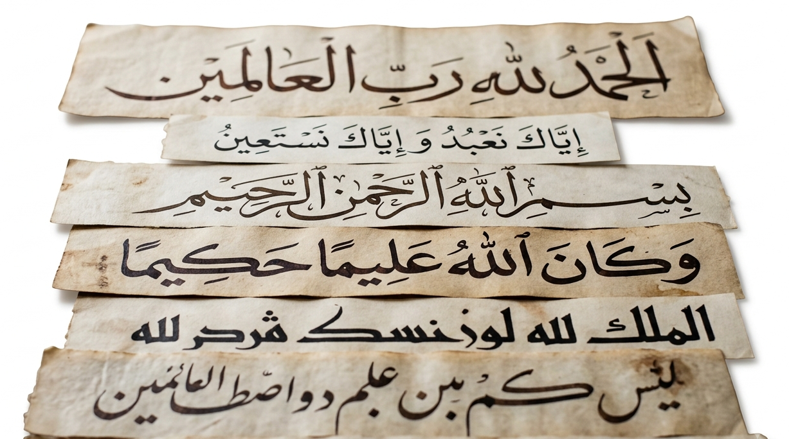

<p align="center">
  
  

  <h1 align="center">Qwen2.5-VL-3B Arabic Manuscript Recognition</h1>
</p>

<p align="center">
  Fine-tuning <strong>Qwen2.5-VL-3B-Instruct</strong> for historical Arabic manuscript recognition.
</p>


<p align="center">
  <a href="https://huggingface.co/Qwen/Qwen2.5-VL-3B-Instruct">
    
  </a>
  <a href="https://huggingface.co/Belgacem123/Qwen2.5-VL-3B-Arabic-Manuscript-Recognition">
    
  </a>
  <a href="https://huggingface.co/spaces/Belgacem123/Arabic-Manuscript-Recognition-Demo">
    
  </a>
</p>

<p align="center">
  
</p>

---

## Overview

Historical Arabic manuscripts are challenging for automatic handwritten text recognition due to variations in handwriting, historical writing conventions, degraded documents, faded ink, image noise, and differences in document quality.

This project adapts **Qwen2.5-VL-3B-Instruct** for Arabic manuscript. Given a manuscript image, the model generates its corresponding Arabic transcription.

The adaptation is performed using **LoRA** through the Hugging Face **PEFT** framework.

---

## Results

| Metric | Score |
|:---|---:|
| **Character Error Rate (CER)** | **6.67%** |
| **Word Error Rate (WER)** | **22.13%** |

Lower values indicate better recognition performance.

## Fine-Tuning

Training was performed on paired manuscript images and their corresponding Arabic transcriptions.

### Configuration

| Parameter | Value |
|---|---:|
| Rank | 128 |
| Alpha | 256 |
| Dropout | 0.05 |
| Learning rate | 1e-5 |
| Batch size | 1 |
| Gradient accumulation | 16 |
| Epochs | 2 |
| Precision | BF16 |
| LR scheduler | Cosine |

---

## Model Integration

The fine-tuned model is integrated into **Kalima OCR**, a comprehensive AI platform for processing and digitizing historical Arabic manuscripts and heritage documents.

Kalima OCR provides a wide range of AI-powered capabilities, including automatic handwriting recognition, manuscript analysis and comparison, intelligent manuscript interaction, heritage content summarization, Quranic text verification and diacritization, Hadith referencing, poetry verification, biographical text processing, and audio transcription.

<p>
  <a href="https://www.kalima-ocr.com/#demo" style="color: black; text-decoration: none;">
    <strong>Explore Kalima OCR and its functionalities </strong>
  </a>
</p>

## Training

Install the required dependencies:

```bash
pip install -r requirements.txt
